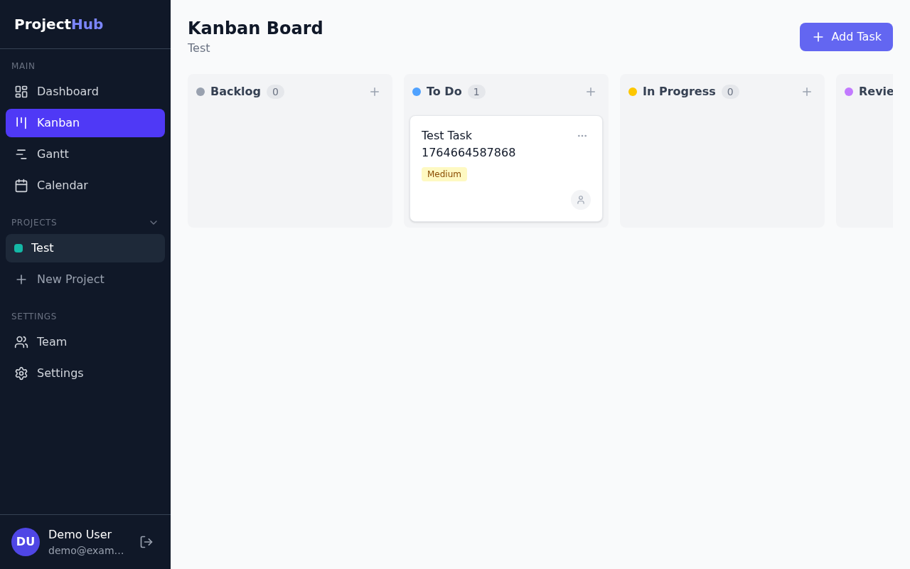
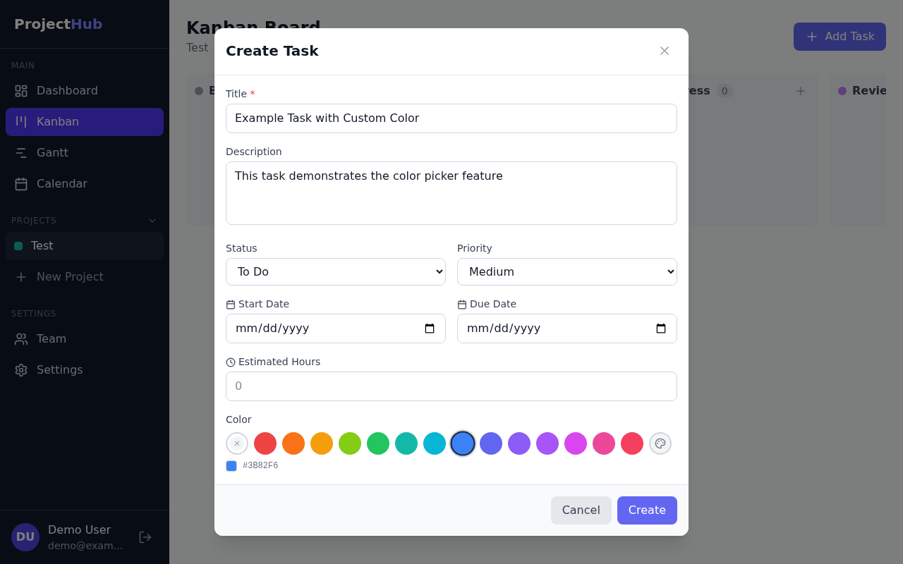
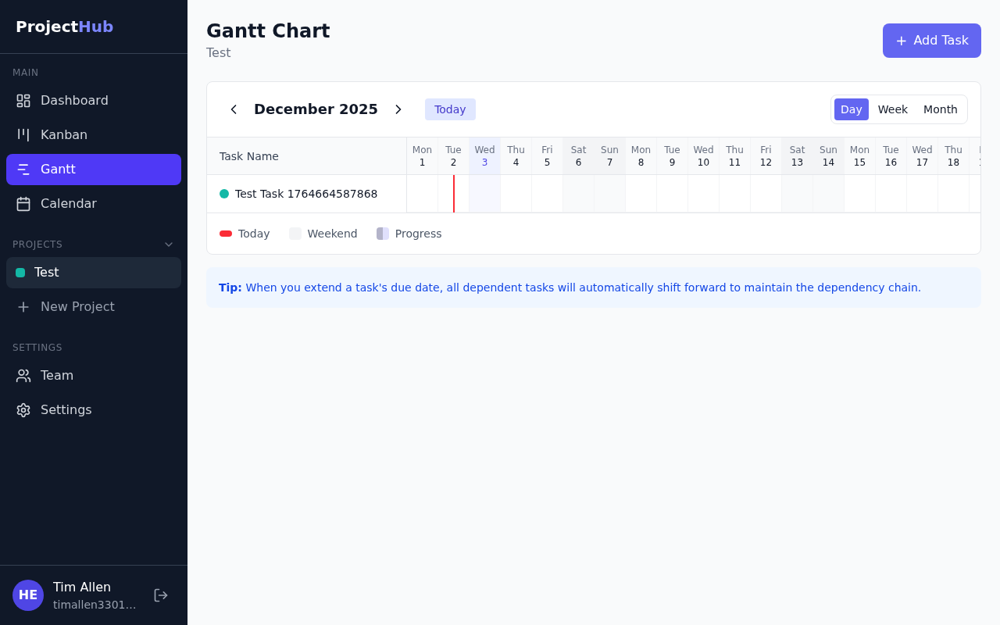
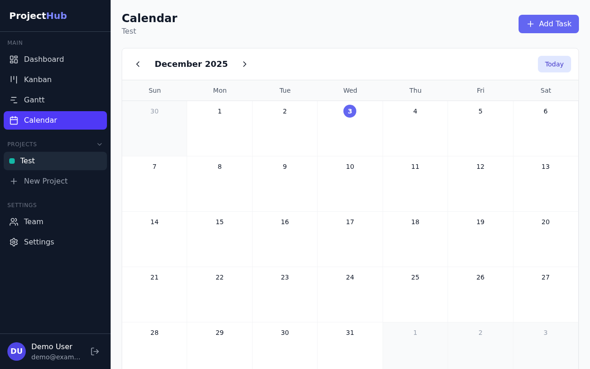
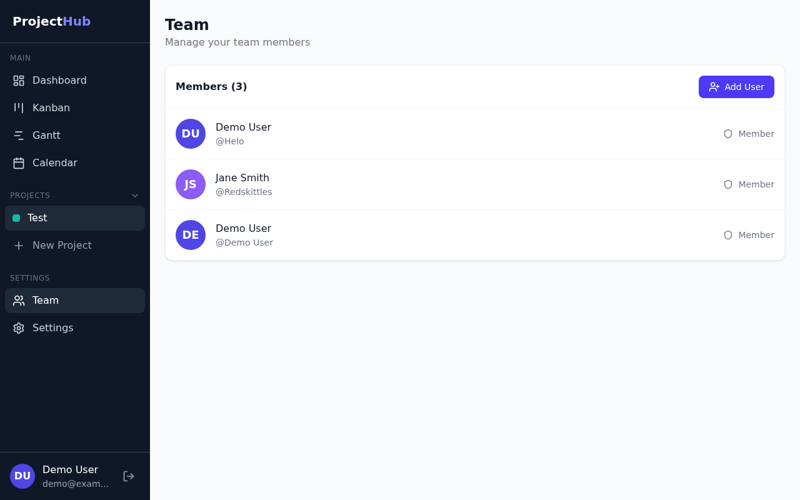
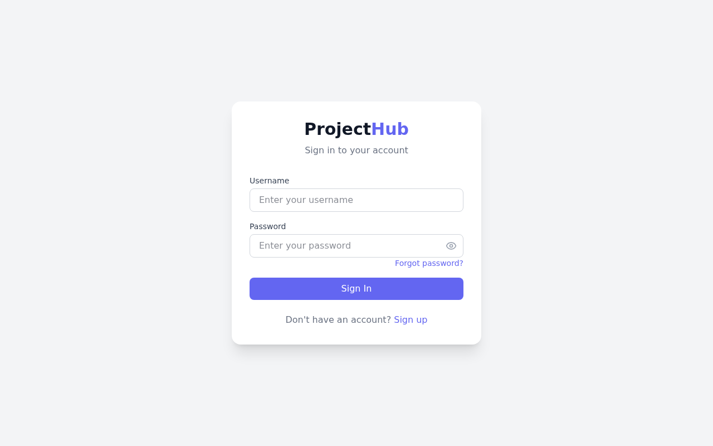

# ProjectHub

A full-stack project management application with Kanban boards, Gantt charts, calendar views, and team collaboration features.


## Features

### Kanban Board
Drag-and-drop task management with customizable columns for different workflow stages.



### Task Management
Create and edit tasks with rich details including:
- Title and description
- Status and priority levels
- Start and due dates
- Time estimates
- Custom color coding
- Assignee management
- Subtask tracking



### Gantt Chart
Visualize project timelines with an interactive Gantt chart showing task dependencies and progress.



### Calendar View
View tasks and deadlines in a monthly calendar format.



### Team Management
Manage team members, assign roles, and track who's working on what.



### Authentication
Secure login with user registration and password reset functionality.



## Tech Stack

### Frontend
- **React 18** with TypeScript
- **Tailwind CSS** for styling
- **React Query** for server state management
- **Zustand** for client state
- **React Router** for navigation
- **Vite** for fast development builds

### Backend
- **FastAPI** (Python)
- **SQLAlchemy** ORM
- **PostgreSQL** database
- **JWT** authentication
- **Pydantic** for validation

### Testing
- **Playwright** for end-to-end testing
- **Vitest** for unit testing

### Infrastructure
- **Docker** & Docker Compose
- **Nginx** for frontend serving

## Getting Started

### Prerequisites
- Docker and Docker Compose
- Node.js 18+ (for local development)
- Python 3.11+ (for local development)

### Quick Start with Docker

```bash
# Clone the repository
git clone https://github.com/Helo3301/projecthub.git
cd projecthub

# Start all services
docker compose up -d

# Access the application
# Frontend: http://localhost:3030
# Backend API: http://localhost:8000
```

### Local Development

#### Frontend
```bash
cd frontend
npm install
npm run dev
```

#### Backend
```bash
cd backend
pip install -r requirements.txt
uvicorn app.main:app --reload
```

### Running Tests

```bash
# E2E tests with Playwright
cd mobile-test
npm install
npx playwright install
npm run test:chrome

# Run specific test suite
npx playwright test 03-kanban.spec.js
```

## Project Structure

```
projecthub/
├── backend/                 # FastAPI Python backend
│   ├── app/
│   │   ├── routers/        # API endpoints
│   │   ├── models.py       # SQLAlchemy models
│   │   ├── schemas.py      # Pydantic schemas
│   │   └── main.py         # Application entry
│   └── requirements.txt
├── frontend/               # React TypeScript frontend
│   ├── src/
│   │   ├── components/     # Reusable components
│   │   ├── pages/          # Page components
│   │   ├── lib/            # API client & utilities
│   │   └── store/          # Zustand store
│   └── package.json
├── mobile-test/            # Playwright E2E tests
│   └── tests/              # Test specifications
├── docs/
│   └── screenshots/        # Application screenshots
└── docker-compose.yml
```

## API Endpoints

| Endpoint | Method | Description |
|----------|--------|-------------|
| `/api/auth/login` | POST | User login |
| `/api/auth/register` | POST | User registration |
| `/api/auth/me` | GET | Current user info |
| `/api/projects` | GET/POST | List/create projects |
| `/api/projects/{id}` | GET/PUT/DELETE | Project CRUD |
| `/api/tasks` | GET/POST | List/create tasks |
| `/api/tasks/{id}` | GET/PUT/DELETE | Task CRUD |
| `/api/users` | GET | List team members |

## Contributing

1. Fork the repository
2. Create a feature branch (`git checkout -b feature/amazing-feature`)
3. Commit your changes (`git commit -m 'Add amazing feature'`)
4. Push to the branch (`git push origin feature/amazing-feature`)
5. Open a Pull Request

## License

This project is open source and available under the [MIT License](LICENSE).
